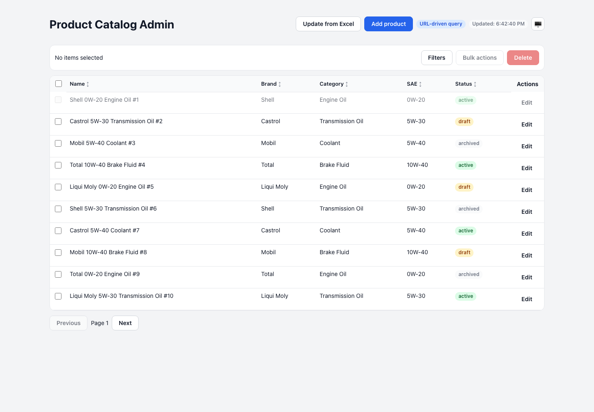
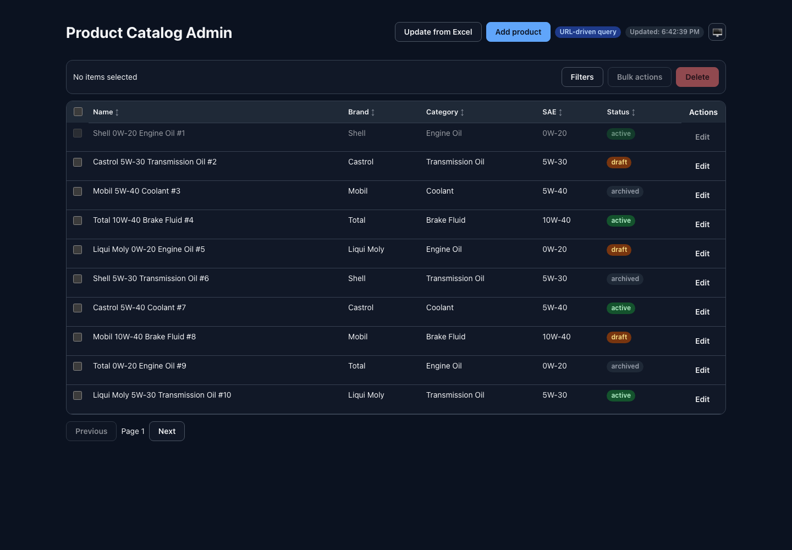
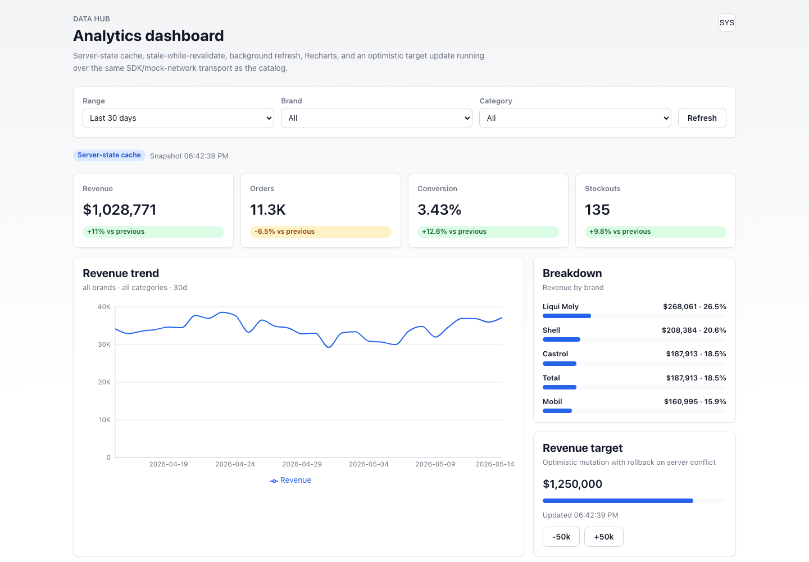
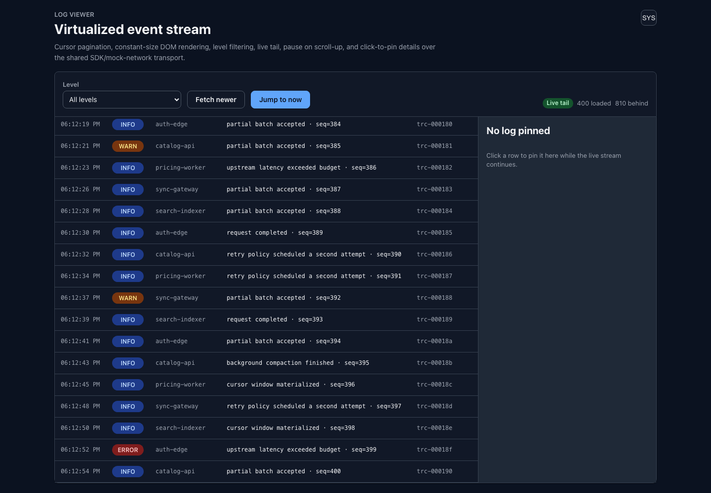

# Frontend Showcase

Production-style monorepo that exercises real data-heavy frontend problems: server-side filters / sorting / pagination, non-trivial selection models, race conditions and partial-success on the API, URL as source of truth, virtualization, server-state caching, and a coherent design system. Built as a **portfolio piece**, not as a shipping product.

> If you have five minutes: skim the [app navigation](#apps), then read [`docs/comparison.md`](docs/comparison.md), which compares approaches to working with data.

## TL;DR — what this repository demonstrates

| Topic | Where to look |
| --- | --- |
| Custom SDK (`httpClient` with injectable `fetch`, `typedStorage`) | [`packages/sdk`](packages/sdk) |
| Custom UI library (atoms / molecules / organisms) with Material 3-inspired design tokens | [`packages/ui`](packages/ui) |
| Reusable hooks (`useUrlQueryState`, `useRequestSequence`, ...) | [`packages/hooks`](packages/hooks) |
| Mock network for honest imitation of a slow API with partial success | [`packages/mock-network`](packages/mock-network) |
| Data-heavy admin with complex selection and URL state | [`apps/product-catalog-admin`](apps/product-catalog-admin) |
| Analytics dashboard on TanStack Query + Recharts | [`apps/data-hub`](apps/data-hub) |
| Log viewer with cursor pagination + virtualization | [`apps/log-viewer`](apps/log-viewer) |
| UI atom sandbox | [`apps/todo-app`](apps/todo-app) |
| Comparison of data-heavy approaches | [`docs/comparison.md`](docs/comparison.md) |
| Performance notes and budgets | [`docs/performance.md`](docs/performance.md) |
| ADRs (why a given decision was taken) | [`docs/decisions/`](docs/decisions/) |

## Verification

```bash
pnpm -r typecheck
pnpm test
pnpm --filter @frontend-showcase/product-catalog-admin build
pnpm --filter @frontend-showcase/data-hub build
pnpm --filter @frontend-showcase/log-viewer build
```

Current test surface: SDK HTTP/storage, mock-network, reusable hooks, and catalog query/selection
models. See [`docs/performance.md`](docs/performance.md) for the performance budget and measurement
notes.

## Screenshots

| Catalog light | Catalog dark |
| --- | --- |
|  |  |

| Data Hub | Log Viewer |
| --- | --- |
|  |  |

## Apps

### `apps/product-catalog-admin` — data-heavy admin

Scenario: B2B product catalog. **The server is slow (500–1200ms)**, does not return an exact `total`, may respond with partial success on bulk operations, and the underlying data can change outside the UI.

What is covered:

- URL as the single source of truth for query state (filters + sort + pagination).
- Three selection modes: `none | some | allMatching` with a query snapshot.
- Pessimistic mutations with partial-success handling (success and failure lists).
- Race-condition guard via a request sequence.
- An "outdated data" notice when other users change the underlying rows.

### `apps/data-hub` — analytics dashboard

Scenario: dashboards with aggregates and charts.

What is covered:

- Server-state cache via **TanStack Query**: stale-while-revalidate, refetch-on-focus, an explicit contrast with the hand-rolled state in the catalog.
- Charts built with **Recharts**.
- Optimistic mutations with rollback.

### `apps/log-viewer` — virtualized list

Scenario: a continuous log stream.

What is covered:

- Cursor pagination (`?cursor=...&limit=...`).
- Virtualization via `@tanstack/react-virtual`.
- "Live tail" with pause-on-scroll-up.

### `apps/todo-app` — sandbox

A tiny app used to manually exercise the UI atoms.

## Packages

### `@frontend-showcase/sdk`

A small, opinionated SDK for talking to backends and persisting state.

- `createHttpClient({ fetch, timeout, retry })` — normalized errors (`HTTP_ERROR`, `TIMEOUT_ERROR`, `NETWORK_ERROR`, `PARSE_ERROR`), idempotent retries with exponential backoff, injectable `fetch` (mock in dev/tests).
- `createTypedStorage({ prefix })` — a JSON-safe wrapper over `localStorage` with typed errors (quota, parse, unavailable).

### `@frontend-showcase/ui`

Hand-rolled atoms / molecules / organisms, no external UI framework. Material 3-inspired design tokens (color roles, type scale, spacing, elevation, density), CSS Modules + CSS variables, dark mode driven by `prefers-color-scheme` and persisted via `typedStorage`.

Key organisms: `DataTable<T>`, `FilterBar`, `BulkActionBar` — all fully controlled, no hidden state, all aware of `SelectionState = none | some | allMatching`.

### `@frontend-showcase/hooks`

Small reusable hooks: `useUrlQueryState`, `useDebouncedValue`, `useRequestSequence`, `useExternalChangeDetector`.

### `@frontend-showcase/mock-network`

Dev-only `createMockFetch(routes)` — a `fetch`-compatible transport with configurable latency, 5xx flake rate, out-of-order responses, partial-success bulk results, and periodic external mutations. Plugs into the SDK via `createHttpClient({ fetch: mockFetch })`.

## Architectural principles

- The SDK knows nothing about React, UI, or a specific API.
- Organisms only render and emit events — no hidden state, no business logic.
- The URL is the source of truth where it makes sense (catalog). A server-state cache is the source of truth where it makes sense (dashboard). Cursor pagination is the source of truth where it makes sense (log viewer). See [`docs/comparison.md`](docs/comparison.md).
- The mock network is a standalone package so each app runs against the same `fetch` API contract that production code would.

## Monorepo layout

```
frontend-showcase/
├── apps/
│   ├── product-catalog-admin/
│   ├── data-hub/
│   ├── log-viewer/
│   └── todo-app/
├── packages/
│   ├── sdk/
│   ├── ui/
│   ├── hooks/
│   └── mock-network/
├── docs/
│   ├── architecture.md
│   ├── dependency-graph.md
│   ├── comparison.md
│   ├── performance.md
│   └── decisions/
├── pnpm-workspace.yaml
├── package.json
└── tsconfig.base.json
```

Details: [`docs/architecture.md`](docs/architecture.md), [`docs/dependency-graph.md`](docs/dependency-graph.md).

## Running locally

```bash
pnpm install

# Catalog
pnpm --filter @frontend-showcase/product-catalog-admin dev

# Dashboard
pnpm --filter @frontend-showcase/data-hub dev

# Log viewer
pnpm --filter @frontend-showcase/log-viewer dev

# UI sandbox
pnpm --filter @frontend-showcase/todo-app dev
```

Requires Node 18+ and pnpm 10+.

## Anti-scope (what this case explicitly does NOT do)

- Does not reimplement AG Grid / a virtualizer / a chart engine — no point competing with libraries where they shine.
- Does not adopt turborepo / nx — overkill for four apps.
- Does not publish packages to npm — they are internal.

## License

[MIT](LICENSE).
