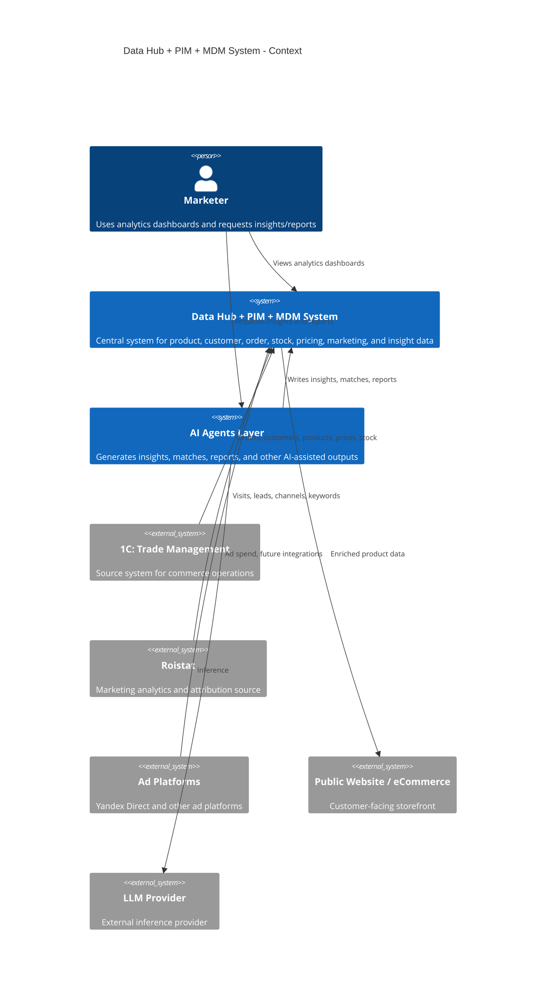
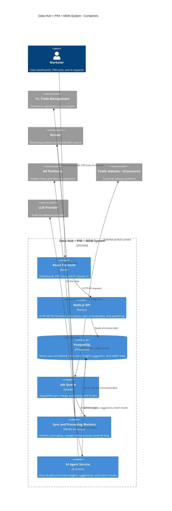

# Data Hub Architecture

This app contains architecture notes and C4 diagrams for the Data Hub product.

## C4 Context Diagram

```mermaid
C4Context
    title Data Hub + PIM + MDM System - Context

    Person(marketer, "Marketer", "Uses analytics dashboards and requests insights/reports")

    System(dataHub, "Data Hub + PIM + MDM System", "Central system for product, customer, order, stock, pricing, marketing, and insight data")
    System(aiAgents, "AI Agents Layer", "Generates insights, matches, reports, and other AI-assisted outputs")

    System_Ext(oneC, "1C: Trade Management", "Source system for commerce operations")
    System_Ext(roistat, "Roistat", "Marketing analytics and attribution source")
    System_Ext(adPlatforms, "Ad Platforms", "Yandex Direct and other ad platforms")
    System_Ext(website, "Public Website / eCommerce", "Customer-facing storefront")
    System_Ext(llmProvider, "LLM Provider", "External inference provider")

    Rel(oneC, dataHub, "Orders, customers, products, prices, stock")
    Rel(roistat, dataHub, "Visits, leads, channels, keywords")
    Rel(adPlatforms, dataHub, "Ad spend, future integrations")

    Rel(dataHub, website, "Enriched product data")

    Rel(marketer, dataHub, "Views analytics dashboards")
    Rel(marketer, aiAgents, "Requests insights and reports")

    Rel(aiAgents, dataHub, "Reads data")
    Rel(aiAgents, dataHub, "Writes insights, matches, reports")
    Rel(aiAgents, llmProvider, "Inference")
```

## C4 Container Diagram

```mermaid
C4Container
    title Data Hub + PIM + MDM System - Containers

    Person(marketer, "Marketer", "Uses dashboards, PIM tools, and AI requests")

    System_Ext(oneC, "1C: Trade Management", "Commerce operations source system")
    System_Ext(roistat, "Roistat", "Marketing analytics and attribution source")
    System_Ext(adPlatforms, "Ad Platforms", "Yandex Direct and other ad platforms")
    System_Ext(website, "Public Website / eCommerce", "Customer-facing storefront")
    System_Ext(llmProvider, "LLM Provider", "External inference provider")

    System_Boundary(dataHub, "Data Hub + PIM + MDM System") {
        Container(web, "React Frontend", "React", "Dashboards, PIM tools, and AI request UI")
        Container(api, "Node.js API", "Node.js", "HTTP API for frontend, data access, sync orchestration, and publishing")
        ContainerDb(db, "PostgreSQL", "PostgreSQL", "Stores raw, normalized, core, mart, insight, suggestion, and match data")
        Container(queue, "Job Queue", "Queue", "Dispatches sync, merge, processing, and AI jobs")
        Container(workers, "Sync and Processing Workers", "Worker processes", "Fetches, normalizes, merges, and processes external data")
        Container(agents, "AI Agent Service", "AI service", "Runs AI jobs and writes insights, suggestions, and match results")
    }

    Rel(marketer, web, "Uses dashboards, PIM tools, AI requests")

    Rel(web, api, "HTTP API requests")

    Rel(api, db, "Reads and writes data")
    Rel(api, queue, "Creates sync, merge, AI jobs")

    Rel(queue, workers, "Dispatches jobs")
    Rel(queue, agents, "Dispatches AI jobs")

    Rel(workers, oneC, "Fetches data")
    Rel(workers, roistat, "Fetches data")
    Rel(workers, adPlatforms, "Fetches ad spend, future integration")

    Rel(workers, db, "Stores raw and normalized data")

    Rel(agents, db, "Reads marts and core data")
    Rel(agents, llmProvider, "Calls inference")
    Rel(agents, db, "Writes insights, suggestions, match results")

    Rel(api, website, "Publishes product content")
```

