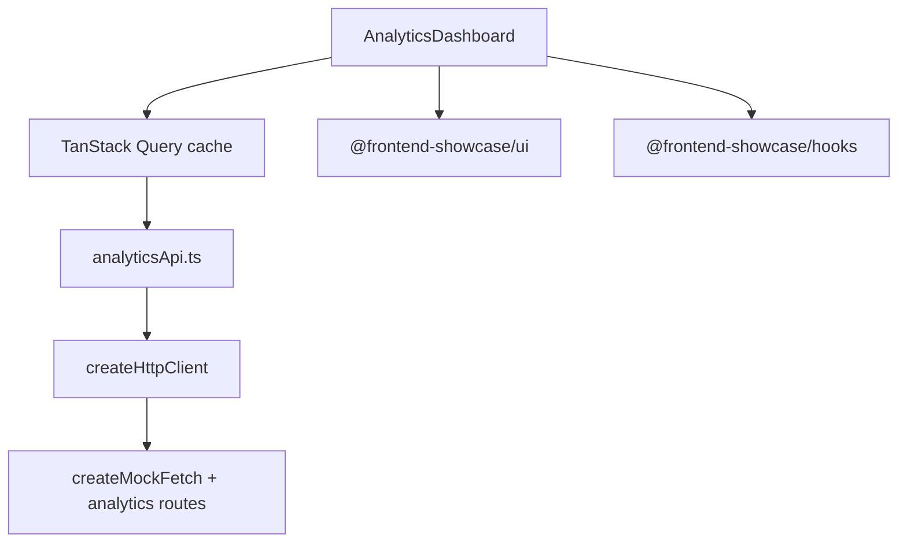

# Data Hub

Analytics dashboard that demonstrates a server-state-cache approach, intentionally contrasting with
the URL-driven catalog app.

## What this app demonstrates

- **TanStack Query as the server-state owner**: cache keys, stale-while-revalidate, refetch on focus,
  30s background refresh, and targeted invalidation.
- **Recharts** for a real charting surface instead of a hand-rolled SVG/chart engine.
- **SDK transport injection**: the app calls `createHttpClient({ fetch: mockFetch })`, so demo data
  still moves through the same HTTP boundary as a production API.
- **Mock network behavior**: latency, occasional 503s, and periodic stale snapshots.
- **Optimistic mutation with rollback**: the revenue target updates immediately and rolls back when
  the mock API returns a conflict.
- **Shared design system**: UI tokens, ThemeProvider, Badge/Button/Select/Skeleton, and persisted
  theme preference via `typedStorage`.

## Running locally

```bash
pnpm --filter @frontend-showcase/data-hub dev
```

## Architecture



The dashboard deliberately does **not** put the entire chart slice into the URL. The meaningful state
is "what the server currently knows", not a deeply shareable table query. See
[`docs/decisions/0005-tanstack-query-for-data-hub.md`](../../docs/decisions/0005-tanstack-query-for-data-hub.md)
and [`docs/comparison.md`](../../docs/comparison.md).
