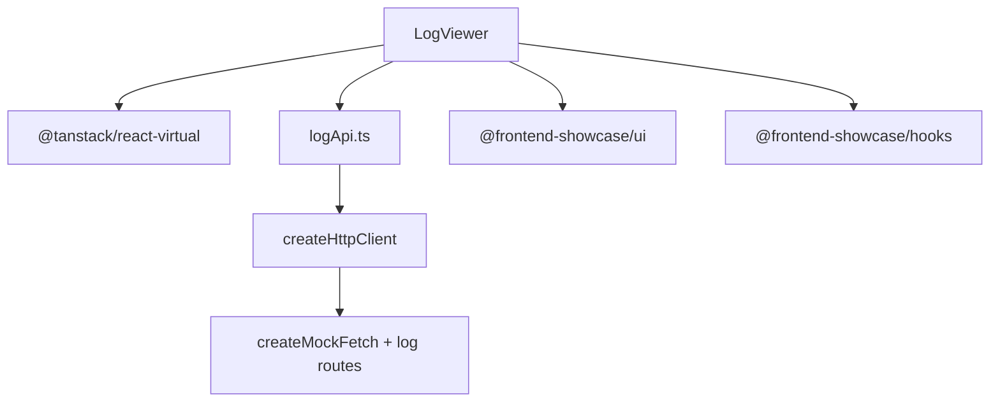

# Log Viewer

Virtualized event stream that demonstrates cursor pagination and live-tail behavior.

## What this app demonstrates

- Cursor pagination: `GET /logs?cursor=...&limit=200&level=...` returns the next append-only window plus a new opaque cursor.
- Virtualization via `@tanstack/react-virtual`: the DOM stays small while the in-memory list grows.
- Live tail: while the user is at the bottom, the app polls for newer rows and keeps the viewport pinned to the latest event.
- Pause on scroll-up: scrolling away from the bottom stops auto-follow so the user can inspect old entries.
- Click-to-pin details: a selected log row remains visible in the side panel while the stream moves.
- SDK + mock-network: the app uses the same `createHttpClient({ fetch: mockFetch })` boundary as the catalog and dashboard.

## Running locally

```bash
pnpm --filter @frontend-showcase/log-viewer dev
```

## Architecture



Unlike the catalog, the URL is not the full source of truth. The level filter is user-facing state, while the cursor is runtime state because it represents a moving stream, not a shareable page. See [`docs/comparison.md`](../../docs/comparison.md).
