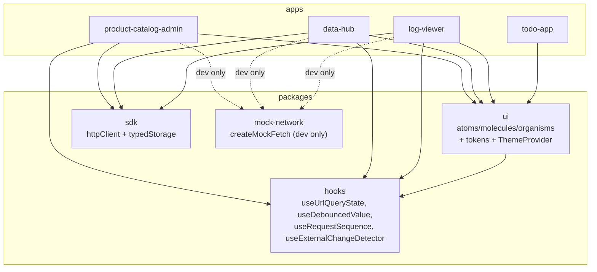

# Architecture

This document describes the architecture of the monorepo as a whole. The architecture of an individual application is documented in that application's own `README.md`.

See also:

- [`docs/dependency-graph.md`](dependency-graph.md) — import rules between packages and apps.
- [`docs/comparison.md`](comparison.md) — comparison of data-handling approaches across the apps.
- [`docs/design-system-phase4.md`](design-system-phase4.md) — what shipped in Phase 4 (tokens, ThemeProvider, CSS Modules, app wiring).
- [`docs/decisions/`](decisions/) — Architecture Decision Records.

## Monorepo layout

```
frontend-showcase/
├── apps/
│   ├── product-catalog-admin/   data-heavy admin (filters/selection/URL)
│   ├── data-hub/                analytics dashboard (TanStack Query + Recharts)
│   ├── log-viewer/              cursor pagination + virtualization
│   └── todo-app/                UI sandbox
├── packages/
│   ├── sdk/                     httpClient (injectable fetch + retry) + typedStorage
│   ├── ui/                      atoms / molecules / organisms + design tokens
│   ├── hooks/                   useUrlQueryState, useDebouncedValue, ...
│   └── mock-network/            dev-only fake fetch with latency / race / partial-success
├── docs/
│   ├── architecture.md
│   ├── dependency-graph.md
│   ├── comparison.md
│   ├── roadmap.md
│   └── decisions/
├── pnpm-workspace.yaml
├── package.json
└── tsconfig.base.json
```

## Dependency layers



Full rules and forbidden imports live in [`docs/dependency-graph.md`](dependency-graph.md).

## Architectural principles

1. **The SDK knows nothing about React, UI, or a specific API.** It is a generic HTTP and storage layer injected into every app. See [`packages/sdk`](../packages/sdk).
2. **`mock-network` is a standalone package, not code inside an app.** Apps run against the same `fetch` API contract as in production; only the injected `fetch` differs.
3. **Organisms in `ui` (`DataTable`, `FilterBar`, `BulkActionBar`) are controlled, with no hidden state.** No `useState` for sort/selection inside; only `props in`, `events out`. Business logic and network calls live outside.
4. **The URL is the source of truth where it makes sense.** `product-catalog-admin` — yes (shareable links, repeatable state). `log-viewer` — partially (only the base filter; the cursor lives in component state). `data-hub` — no (server-state cache matters more than URL shareability).
5. **Design tokens live in `packages/ui`.** Apps do not set inline colors. See ADR `0007`.

## Where to find each application's architecture

| App | Document |
| --- | --- |
| `product-catalog-admin` | `apps/product-catalog-admin/README.md` (TBD) |
| `data-hub` | [`apps/data-hub/README.md`](../apps/data-hub/README.md) — contains C4 Context and Container diagrams |
| `log-viewer` | `apps/log-viewer/README.md` (TBD) |
| `todo-app` | `apps/todo-app/README.md` (TBD) |
