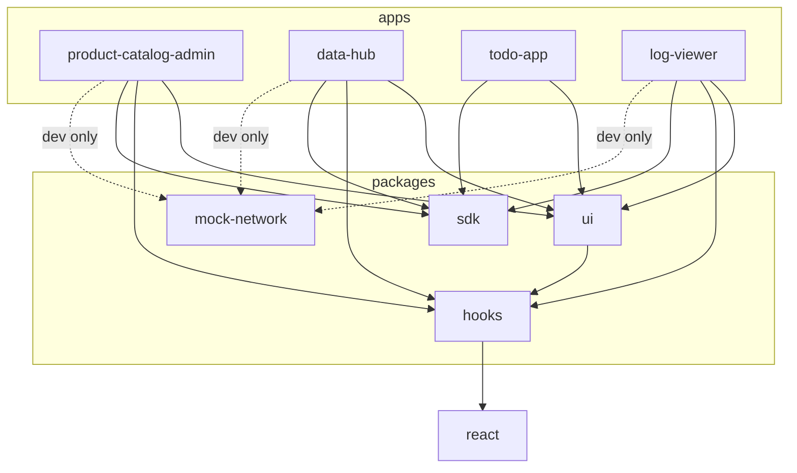

# Dependency graph

## Allowed imports

## Rules

- Apps may import workspace packages; apps must not import other apps.
- `sdk` must not import React, `ui`, `hooks`, or app code.
- `hooks` may depend on React but must not depend on `ui`, `sdk`, or app code.
- `ui` may use hooks, but it must not know about apps or the SDK.
- `mock-network` is dev/demo transport and is injected into SDK clients from apps.
